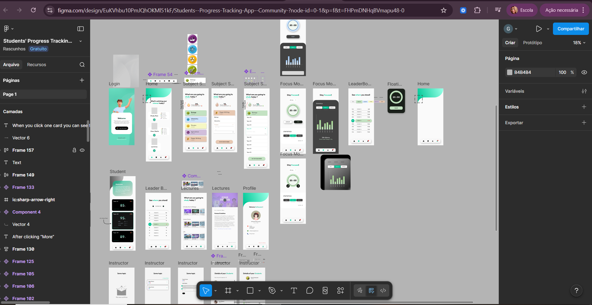
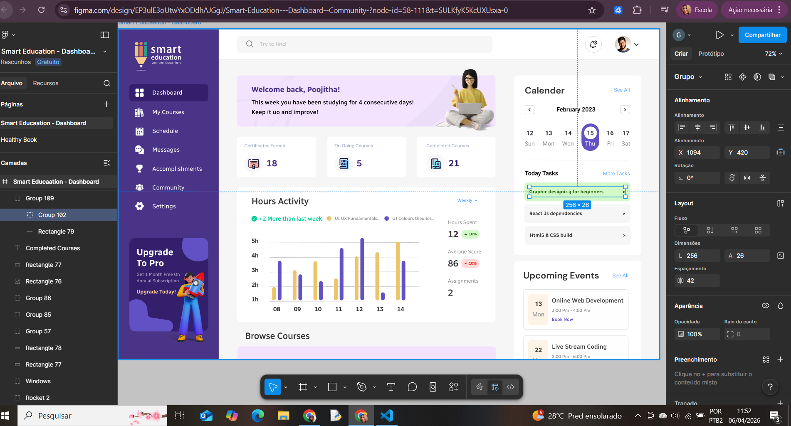

# Referências de Design - EduTrack AI

## Template 1
[[Link do Figma](https://www.figma.com/design/EuKVhbu10PmJQhOKMl51kF/Students--Progress-Tracking-App--Community-?node-id=404-284&t=FHPmDNHqBVmapu48-0)

Este primeiro template me chamou atenção pois é intuitivo, muito completo, com diversas funcionalidades interessantes, como o quadro da estatística de horas estudadas, tanto diariamente, quanto semanal e mensal.

---

## Template 2
[[Link do Figma](https://www.figma.com/proto/EP3ulE3oUtwYxODdhAJGgJ/Smart-Education---Dashboard--Community-?node-id=55-102&t=SULKfyK5KcUXUsxa-0&scaling=min-zoom&content-scaling=fixed&page-id=0%3A1)

Já esse, me chamou atenção pois em uma única tela reúne diversas informações importantes, possui o calendário na lateral com as atividades do dia, sem falar do gráfico que ajuda a entender melhor os estudos.

